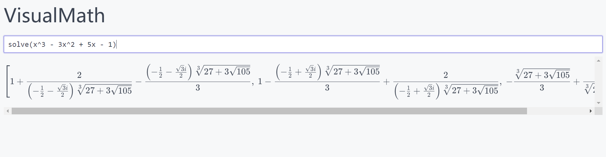

# VisualMath

[🚀 中文](./README.zh.md)


Sympy-based mathematical computing services.

Framework for Open Source Mathematical Computing Services.

Simple and easy to use, it is a nice little tool to get rid of the DOS sympy can only see characters, not see the trouble of mathematical equations.

The methods currently supported within SymPy are basically callable.

> Note: This project is probably rarely maintained, as this service is not reliable or secure. I am designing the SymPy tool library for WebAssembly support and will be releasing client and design reports, which may take some time to optimize.




## Usage

Make sure the Python version is above 3.7, then clone the project and install the dependencies:

```bash
git clone https://github.com/Sun-ZhenXing/VisualMath
cd VisualMath
pip install -r requirements.txt
python sanic_server.py
```

Open: <http://127.0.0.1:3389/>

If you need to support drawing, you can install `matplotlib`. If you need a real-time GUI, you can comment the following code.

```python
# sanic_server.py line 2
matplotlib.use('agg')
```

## License | 许可证

MIT.
