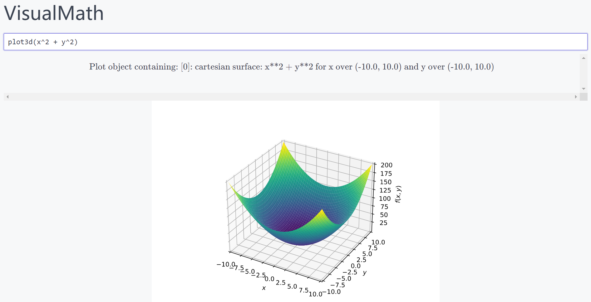
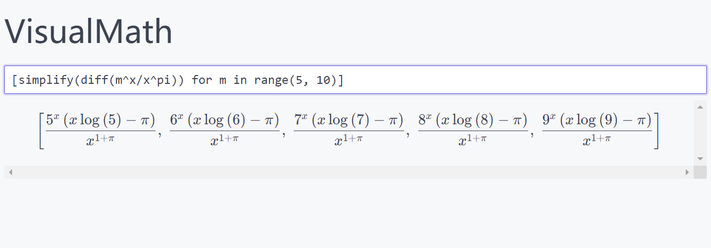
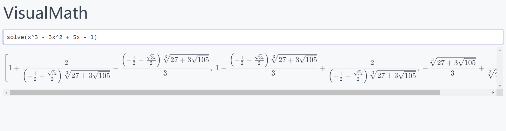

# VisualMath：可视化你的数学计算



基于 Sympy 的数学计算服务，基于开源数学计算服务框架。

简洁易用，是一个不错的小工具，摆脱了 DOS 下 Sympy 只能看见字符，看不到数学公式的烦恼。

目前支持 SymPy 内的方法基本都可以调用，因为完全就是封装了一层网页而已。

> 注意：此项目可能很少维护，因为这种服务不可靠也不安全。我在设计 WebAssembly 支持的 SymPy 工具库，并且将发布客户端和设计报告，可能需要一些时间来优化。





---

> 2023 年 10 月 17 日更新：
>
> 即将更新架构，未来将使用 WebAssembly 计算。前端使用工程化构建，使用 Nuxt3 + TS，将支持更多功能。

## 使用方法

确保 Python 版本在 3.7 以上，然后克隆项目，安装依赖即可：

```bash
git clone https://github.com/Sun-ZhenXing/VisualMath
cd VisualMath
pip install -r requirements.txt
python sanic_server.py
```

打开：<http://127.0.0.1:3389/>

如果需要支持绘图，可以安装 `matplotlib`。如果需要实时 GUI，需要注释下面这一句：

```python
# sanic_server.py line 2
matplotlib.use('agg')
```

## 许可证

MIT.
